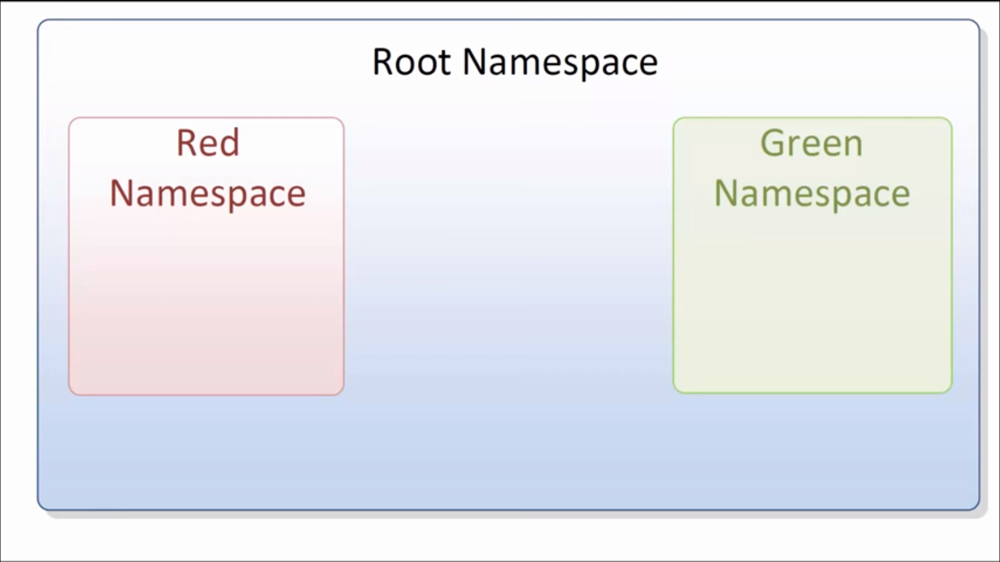
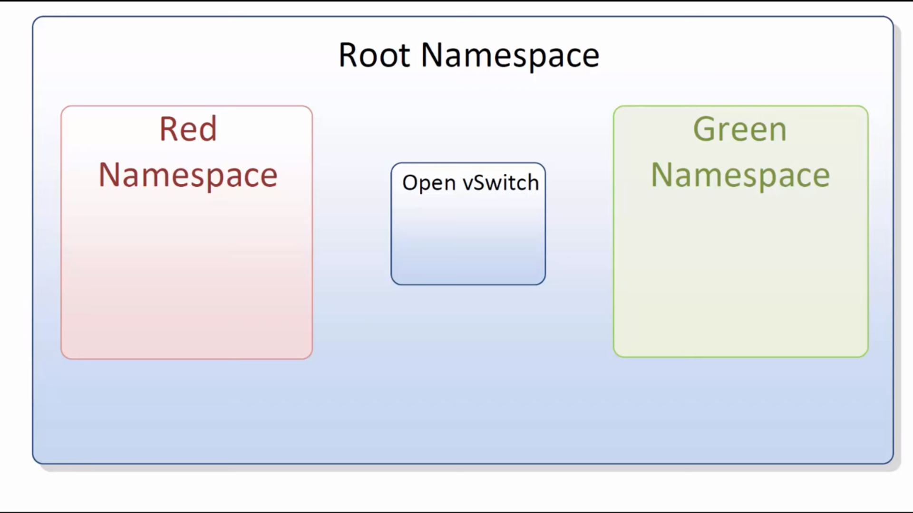
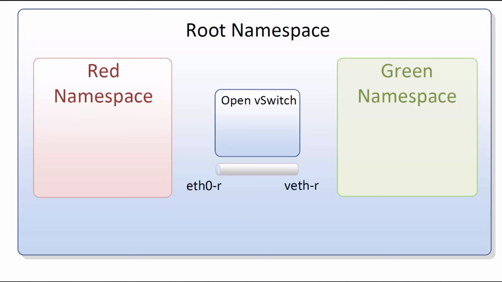
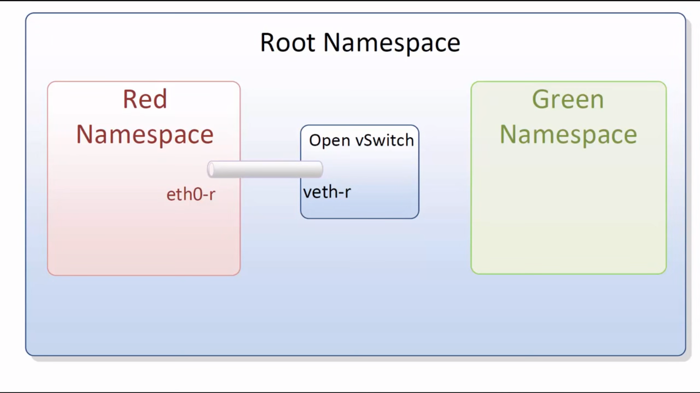
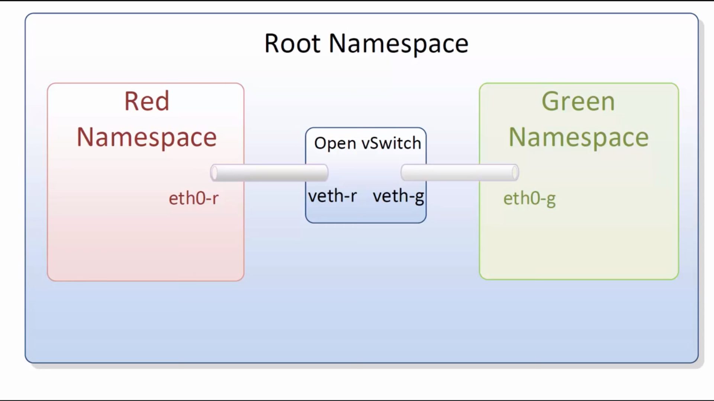

# Que son los Linux namespaces
* Multiples entornos de red aislados en un solo host o VM.
* Cada namespace tiene sus propias interfaces, tablas de ruteo y tablas de forwarding.
* Se pueden dedicar procesos a un namespace de red.
* Usado en OpenStack, Mininet, Docker ...
Imitamos las operaciones de Mininet.
Dos host conectados a una instancia de OVS.

## Root namespace
Es el entorno por default en Linux.
Inspeccionamos el namespace
```
○ → ip link
1: lo: <LOOPBACK,UP,LOWER_UP> mtu 65536 qdisc noqueue state UNKNOWN mode DEFAULT group default qlen 1
    link/loopback 00:00:00:00:00:00 brd 00:00:00:00:00:00
2: ens32: <BROADCAST,MULTICAST,UP,LOWER_UP> mtu 1500 qdisc pfifo_fast state UNKNOWN mode DEFAULT group default qlen 1000
    link/ether 00:0c:29:b3:b0:05 brd ff:ff:ff:ff:ff:ff
```
```
○ → ip a
1: lo: <LOOPBACK,UP,LOWER_UP> mtu 65536 qdisc noqueue state UNKNOWN group default qlen 1
    link/loopback 00:00:00:00:00:00 brd 00:00:00:00:00:00
    inet 127.0.0.1/8 scope host lo
       valid_lft forever preferred_lft forever
    inet6 ::1/128 scope host
       valid_lft forever preferred_lft forever
2: ens32: <BROADCAST,MULTICAST,UP,LOWER_UP> mtu 1500 qdisc pfifo_fast state UNKNOWN group default qlen 1000
    link/ether 00:0c:29:b3:b0:05 brd ff:ff:ff:ff:ff:ff
    inet 192.168.1.50/24 brd 192.168.1.255 scope global ens32
       valid_lft forever preferred_lft forever
    inet6 fe80::20c:29ff:feb3:b005/64 scope link
       valid_lft forever preferred_lft forever
```
```
○ → ip route
default via 192.168.1.1 dev ens32 onlink
192.168.1.0/24 dev ens32  proto kernel  scope link  src 192.168.1.50
```
Observamos solo una interface loopback y ens32. Sus direcciones y tabla de ruteo
## Crear namespaces
Creamos dos namespaces red y green. Cada uno de estos namespaces representaran un host en nuestra topología.
```
ip netns add red
ip netns add green
```
Observamos los namespaces recien creados.
```
root@ubuntu:~# ip netns
red
green
```
ó
```
root@ubuntu:~# ls /var/run/netns
green  red
```
Si desearamos eliminar el namespace: ``ip netns del red``.
La isguiente imagen representa la topologia

Los ambientes de red de red y green están aislados el uno del otro y del namespace root.
Inspeccionamos los namespaces.
```
root@ubuntu:~# ip netns exec red ip link
1: lo: <LOOPBACK> mtu 65536 qdisc noop state DOWN mode DEFAULT group default qlen 1
    link/loopback 00:00:00:00:00:00 brd 00:00:00:00:00:00
```
Con este comando estamos ejecutando el comando ip link directamente en el namespace de red. Observamos solo una interface loopback y con el estado DOWN.
Lo mismo sucede en green:
```
root@ubuntu:~# ip netns exec green ip link
1: lo: <LOOPBACK> mtu 65536 qdisc noop state DOWN mode DEFAULT group default qlen 1
    link/loopback 00:00:00:00:00:00 brd 00:00:00:00:00:00
```
Para emular una red como lo hace mininet debemos conectar namespaces con un switch virtual, usamos OVS. Las instancias de OVS estaran en el namespace root.
Creamos un switch OVS con el nombre OVS1.
```
root@ubuntu:~# ovs-vsctl add-br OVS1
```
Confirmamos
```
root@ubuntu:~# ovs-vsctl show
85d2f426-5bd8-4b58-a985-f3dc51347b42
    Bridge "OVS1"
        Port "OVS1"
            Interface "OVS1"
                type: internal
    ovs_version: "2.5.2"
```
Podemos observar la existencia de la nueva interface ``OVS1`` en el namespace root.
```
root@ubuntu:~# ip link
1: lo: <LOOPBACK,UP,LOWER_UP> mtu 65536 qdisc noqueue state UNKNOWN mode DEFAULT group default qlen 1
    link/loopback 00:00:00:00:00:00 brd 00:00:00:00:00:00
2: ens32: <BROADCAST,MULTICAST,UP,LOWER_UP> mtu 1500 qdisc pfifo_fast state UNKNOWN mode DEFAULT group default qlen 1000
    link/ether 00:0c:29:b3:b0:05 brd ff:ff:ff:ff:ff:ff
3: ovs-system: <BROADCAST,MULTICAST> mtu 1500 qdisc noop state DOWN mode DEFAULT group default qlen 1
    link/ether 3e:be:dd:78:8c:8a brd ff:ff:ff:ff:ff:ff
4: OVS1: <BROADCAST,MULTICAST> mtu 1500 qdisc noop state DOWN mode DEFAULT group default qlen 1
    link/ether 0a:f4:5d:a3:7b:41 brd ff:ff:ff:ff:ff:ff
```
La topología es la siguiente.

### Virtual Ethernet Interfaces
Para conectar los namespaces red y green a OVS1 usaremos pares veth (virtual ethernet interfaces). Los pares veth actuan como un pipe, lo que entra por un extremo sale por el otro. Podemos usar los pares veth para cruzar los namespaces.
Creamos un par veth con un extremo llamado ``eth0-r`` que pertenecera al namespace red. El otro extremo llamado ``veth-r`` que se conectara a la instancia de OVS en el namespace root.
```
root@ubuntu:~# ip link add eth0-r type veth peer name veth-r
```
Topología:

Observamos el par veth representado como un tubo, aún no conectado a nada.
Con el comando ``ip link`` observamos ambos extremos del par veth en el namespace root:
```
root@ubuntu:~# ip link
...
5: veth-r@eth0-r: <BROADCAST,MULTICAST,M-DOWN> mtu 1500 qdisc noop state DOWN mode DEFAULT group default qlen 1000
    link/ether 72:9a:93:03:86:13 brd ff:ff:ff:ff:ff:ff
6: eth0-r@veth-r: <BROADCAST,MULTICAST,M-DOWN> mtu 1500 qdisc noop state DOWN mode DEFAULT group default qlen 1000
    link/ether 7e:24:0d:3a:4f:90 brd ff:ff:ff:ff:ff:ff
```
Tenemos que conectar un extremo del pipe al namespace red y el otro extremo a la instancia de OVS.
Colocamos el extremo eth0-r en el namespace red:
```
root@ubuntu:~# ip link set eth0-r netns red
```
Confirmamos que la interface eth0-r desaparecio del namespace de root:
```
root@ubuntu:~# ip link
1: lo: <LOOPBACK,UP,LOWER_UP> mtu 65536 qdisc noqueue state UNKNOWN mode DEFAULT group default qlen 1
    link/loopback 00:00:00:00:00:00 brd 00:00:00:00:00:00
2: ens32: <BROADCAST,MULTICAST,UP,LOWER_UP> mtu 1500 qdisc pfifo_fast state UNKNOWN mode DEFAULT group default qlen 1000
    link/ether 00:0c:29:b3:b0:05 brd ff:ff:ff:ff:ff:ff
3: ovs-system: <BROADCAST,MULTICAST> mtu 1500 qdisc noop state DOWN mode DEFAULT group default qlen 1
    link/ether 3e:be:dd:78:8c:8a brd ff:ff:ff:ff:ff:ff
4: OVS1: <BROADCAST,MULTICAST> mtu 1500 qdisc noop state DOWN mode DEFAULT group default qlen 1
    link/ether 0a:f4:5d:a3:7b:41 brd ff:ff:ff:ff:ff:ff
5: veth-r@if6: <BROADCAST,MULTICAST> mtu 1500 qdisc noop state DOWN mode DEFAULT group default qlen 1000
    link/ether 72:9a:93:03:86:13 brd ff:ff:ff:ff:ff:ff link-netnsid 0
```
Esto se debe a que fue movida al namespace red que esta aislado. Si ejecutamos el comando ``ip link`` en el namespace red poremos observar la interface eth0-r.
```
root@ubuntu:~# ip netns exec red ip link
1: lo: <LOOPBACK> mtu 65536 qdisc noop state DOWN mode DEFAULT group default qlen 1
    link/loopback 00:00:00:00:00:00 brd 00:00:00:00:00:00
6: eth0-r@if5: <BROADCAST,MULTICAST> mtu 1500 qdisc noop state DOWN mode DEFAULT group default qlen 1000
    link/ether 7e:24:0d:3a:4f:90 brd ff:ff:ff:ff:ff:ff link-netnsid 0
```
Ahora conectamos el otro extremo del par veth a OVS.
```
root@ubuntu:~# ovs-vsctl add-port OVS1 veth-r
```
Este comando conecta el extremo veth-r a OVS1. Si ejecutamos ``ovs-vsctl show`` podremos observar el puerto e interface veth-r:
```
root@ubuntu:~# ovs-vsctl show
85d2f426-5bd8-4b58-a985-f3dc51347b42
    Bridge "OVS1"
        Port "OVS1"
            Interface "OVS1"
                type: internal
        Port veth-r
            Interface veth-r
    ovs_version: "2.5.2"
```
Ahora tenemos el namespace red conectado a la instancia de OVS.

Repetimos el mismo procedimiento para el namespace green para conectarlo a OVS.
Creamos otro par veth con un extremo eth0-g y otro veth-g:
```
root@ubuntu:~# ip link add eth0-g type veth peer name veth-g
```
Colocamos el extremo eth-g en el namespace green:
```
root@ubuntu:~# ip link set eth0-g netns green
```
Conectamos veth-g a OVS1:
```
root@ubuntu:~# ovs-vsctl add-port OVS1 veth-g
```
Ahora ambos extremos tienen un camino para llegar al otro via OVS:

### Levantar interfaces y asignar direcciones IP
Comenzamos con el link al namespace red.
```
root@ubuntu:~# ip link set veth-r up
root@ubuntu:~# ip link
...
5: veth-r@if6: <NO-CARRIER,BROADCAST,MULTICAST,UP> mtu 1500 qdisc noqueue master ovs-system state LOWERLAYERDOWN mode DEFAULT group default qlen 1000
    link/ether 72:9a:93:03:86:13 brd ff:ff:ff:ff:ff:ff link-netnsid 0
```
Ahora debemos trabajar dentro del namespace rojo y ejecutar comandos ip link alli.
``` bash
#Levantar interface loopback
root@ubuntu:~ ip netns exec red ip link set dev lo up
#Levantar interface eth0-r
root@ubuntu:~ ip netns exec red ip link set dev eth0-r up
#Asignar ip a eth0-r
root@ubuntu:~ ip netns exec red ip address add 10.0.0.1/24 dev eth0-r
#Observamos el resultaso
root@ubuntu:~ ip netns exec red ip a
1: lo: <LOOPBACK,UP,LOWER_UP> mtu 65536 qdisc noqueue state UNKNOWN group default qlen 1
    link/loopback 00:00:00:00:00:00 brd 00:00:00:00:00:00
    inet 127.0.0.1/8 scope host lo
       valid_lft forever preferred_lft forever
    inet6 ::1/128 scope host
       valid_lft forever preferred_lft forever
6: eth0-r@if5: <BROADCAST,MULTICAST,UP,LOWER_UP> mtu 1500 qdisc noqueue state UP group default qlen 1000
    link/ether 7e:24:0d:3a:4f:90 brd ff:ff:ff:ff:ff:ff link-netnsid 0
    inet 10.0.0.1/24 scope global eth0-r
       valid_lft forever preferred_lft forever
    inet6 fe80::7c24:dff:fe3a:4f90/64 scope link
       valid_lft forever preferred_lft forever
#Comprobamos la existencia de una ruta para el namespace red
root@ubuntu:~ ip netns exec red ip route
10.0.0.0/24 dev eth0-r  proto kernel  scope link  src 10.0.0.1
```
Devuelta el namespace root, observamos que no hay ninguna ruta 10.0.0/24. Esto es esperado ya que el ruteo de los namespaces es aislado.
```
root@ubuntu:~# ip route
default via 192.168.1.1 dev ens32 onlink
192.168.1.0/24 dev ens32  proto kernel  scope link  src 192.168.1.50
```
Repetimos el mismo procedimiento para el namespace green
```
root@ubuntu:~# ip link set dev veth-g up
```
Podemos iniciar una sesion bash para no repetir ``ip netns exec``.
```
ip netns exec green bash
root@ubuntu:~# ip link set dev lo up
root@ubuntu:~# ip link set dev eth0-g up
root@ubuntu:~# ip address add 10.0.0.2/24 dev eth0-g
root@ubuntu:~# ip a
1: lo: <LOOPBACK,UP,LOWER_UP> mtu 65536 qdisc noqueue state UNKNOWN group default qlen 1
    link/loopback 00:00:00:00:00:00 brd 00:00:00:00:00:00
    inet 127.0.0.1/8 scope host lo
       valid_lft forever preferred_lft forever
    inet6 ::1/128 scope host
       valid_lft forever preferred_lft forever
8: eth0-g@if7: <BROADCAST,MULTICAST,UP,LOWER_UP> mtu 1500 qdisc noqueue state UP group default qlen 1000
    link/ether ee:6d:3d:7f:0c:6a brd ff:ff:ff:ff:ff:ff link-netnsid 0
    inet 10.0.0.2/24 scope global eth0-g
       valid_lft forever preferred_lft forever
    inet6 fe80::ec6d:3dff:fe7f:c6a/64 scope link
       valid_lft forever preferred_lft forever
root@ubuntu:~# exit
```
Comprobamos la conectividdadd con un ping.
```
root@ubuntu:~# ip netns exec red bash
root@ubuntu:~# ping -c5 10.0.0.2
PING 10.0.0.2 (10.0.0.2) 56(84) bytes of data.
64 bytes from 10.0.0.2: icmp_seq=1 ttl=64 time=0.266 ms
64 bytes from 10.0.0.2: icmp_seq=2 ttl=64 time=0.053 ms
64 bytes from 10.0.0.2: icmp_seq=3 ttl=64 time=0.054 ms
64 bytes from 10.0.0.2: icmp_seq=4 ttl=64 time=0.057 ms
64 bytes from 10.0.0.2: icmp_seq=5 ttl=64 time=0.055 ms

--- 10.0.0.2 ping statistics ---
5 packets transmitted, 5 received, 0% packet loss, time 3997ms
rtt min/avg/max/mdev = 0.053/0.097/0.266/0.084 ms
```
### Resultado
Obtenemos la emulación de dos hosts conectados por Open vSwitch.

# Componentes principales
## VSWITCHD
Es un modulo de kernel.
Si hay un match en cache del modulo al llegar un paquete se toman las acciones en cache. Si no hay un match en el modulo se envia el paquete a __VSWITCHD__ en espacio de usuario. Los paquetes futuros que tengan un match haran un camino más rápido a traves del cache del modulo.
