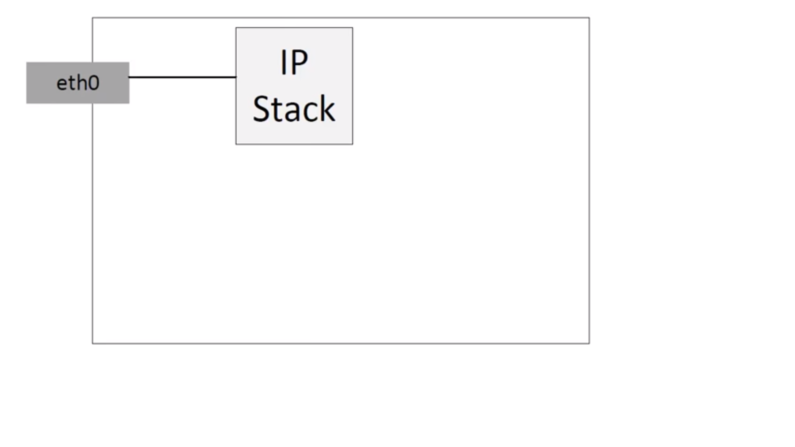
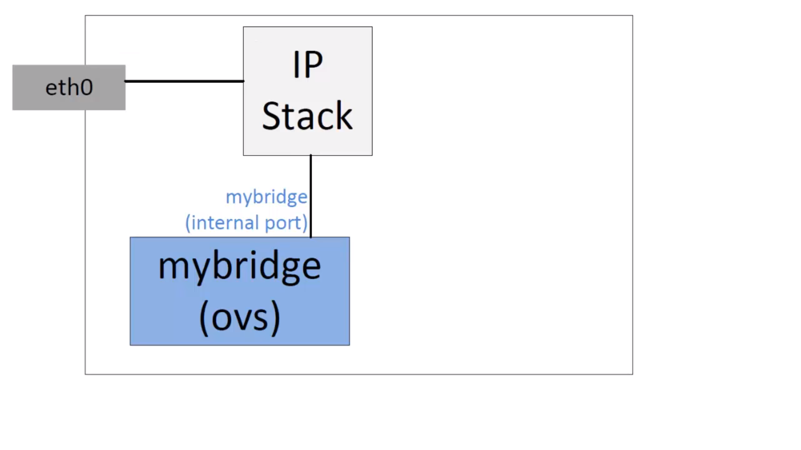
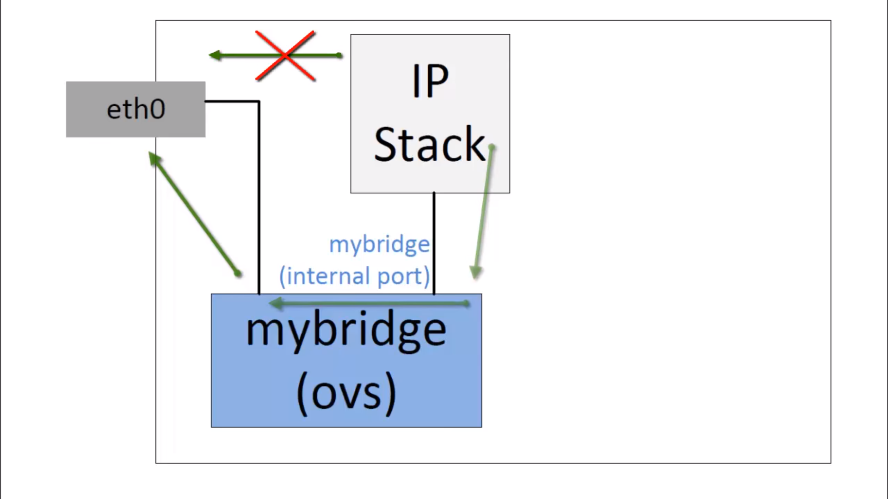

Hypervisors necesitan la posibilidad de puentear tráfico entre VMs y el mundo exterior. En Hypervisors basados en Linux esto significaba usar el switch ya incorporado (Linux bridge) el cual es rápido y confiable. Entonces por qué usar Open vSwitch.

OVS apunta a los desplieges de servidores multi-virtualización, un panorama para el cual Linux bridge no es lo más adecuado. Estos entornos estan caracterizados por extremos altamente dinámicos, mantenimiento de abstracciones lógicas, y a veces la integración o descarga a hardware especializado en switching.

Open vSwitch es un switch OpenFlow que tipicamente es usado con hypervisors con el fin de interconectar maquinas virtuales dentro de un host y maquinas virtuales dentro de distintos hosts a lo largo de varias redes. También es usado en algunos tipos de hardware dedicado al switching. Puede ser una parate crítica en una solución SDN.

OVS soporta las siguentes características:
* VLAN taggin y 802.1q trunking.
* Standar spanning tree protocol (802.1D).
* LACP.
* Port mirroring (SPAN/RSPAN).
* Flow export.
* Tunneling (GRE, VXLAN, IPSEC).
* Control QoS.

### Demostración.
#### Estado inicial
eth0 obtiene su ip y default gateway por DHCP.


Creamos un switch virtual.
``` bash
root@ubuntu:~ ovs-vsctl add-br mybridge
root@ubuntu:~ ovs-vsctl show
85d2f426-5bd8-4b58-a985-f3dc51347b42
    Bridge mybridge
        Port mybridge
            Interface mybridge
                type: internal
    ovs_version: "2.5.2"
```
Aqui vemos la el switch creado, con un solo puerto interno con el nombre mybridge

Luego levantamos el puerto con ifconfig
``` bash
root@ubuntu:~ ifconfig mybridge up
root@ubuntu:~ ifconfig
mybridge  Link encap:Ethernet  HWaddr aa:f8:c3:5c:2e:4c
          inet6 addr: fe80::a8f8:c3ff:fe5c:2e4c/64 Scope:Link
          UP BROADCAST RUNNING MULTICAST  MTU:1500  Metric:1
          RX packets:0 errors:0 dropped:0 overruns:0 frame:0
          TX packets:3 errors:0 dropped:0 overruns:0 carrier:0
          collisions:0 txqueuelen:1
          RX bytes:0 (0.0 B)  TX bytes:258 (258.0 B)
```
Podemos ver la interface ``mybridge``. Si deseamos eliminar la interface: ```ovs-vsctl del-br mybridge```

El siguiente diagrama demuestra el estado de nuestro entorno.

El switch esta aislado, no esta conectado a ningún lado solo al stack IP local. eth0 todavía no esta conectado directamente al switch. Aún no ha cambiado nada, si deseamos realizar una conección con el exterior seguiria saliendo por eth0 de forma directa. Mas adelante conectaremos eth0 a mybridge.
Para conectar eth0 a mybridge:
``` bash
ovs-vsctl add-port mybridge eth0
```
Verificamos
``` bash
ovs-vsctl show
Bridge mybridge
  Port mybridge
    Interface mybridge
      type: internal
  Port "ens32"
    interface "ens32"
```
Perdimos conectividad con internet.
Con el comando ``ovs-vsctl add port mybridge eth0`` redirigimos eth0 para que este conectado con mybridge. Pero estamos tratando de salir por eth0 directamente. Ahora debemos pasar por el switch para salir. Para solucionar esto:


Eliminar la direccion IP de eth0 y asignar DHCP
```
ifconfig eth0 0
dhclient mybridge
```
Verificamos con ``ifconfig`` la asignacio IP  de mybridge:
```
mybridge  Link encap:Ethernet  HWaddr 00:0c:29:b3:b0:05
          inet addr:192.168.1.101  Bcast:192.168.1.255  Mask:255.255.255.0
          inet6 addr: fe80::a8f8:c3ff:fe5c:2e4c/64 Scope:Link
          UP BROADCAST RUNNING MULTICAST  MTU:1500  Metric:1
          RX packets:524 errors:0 dropped:0 overruns:0 frame:0
          TX packets:107 errors:0 dropped:0 overruns:0 carrier:0
          collisions:0 txqueuelen:1
          RX bytes:104203 (104.2 KB)  TX bytes:13940 (13.9 KB)
```
Comprobamos las rutas con ``route -n``
```
Kernel IP routing table
Destination     Gateway         Genmask         Flags Metric Ref    Use Iface
0.0.0.0         192.168.1.1     0.0.0.0         UG    0      0        0 mybridge
192.168.1.0     0.0.0.0         255.255.255.0   U     0      0        0 mybridge
```
Observamos que tenemos una ruta via el puerto mybridge. El ping ahora debería ser exitoso.
