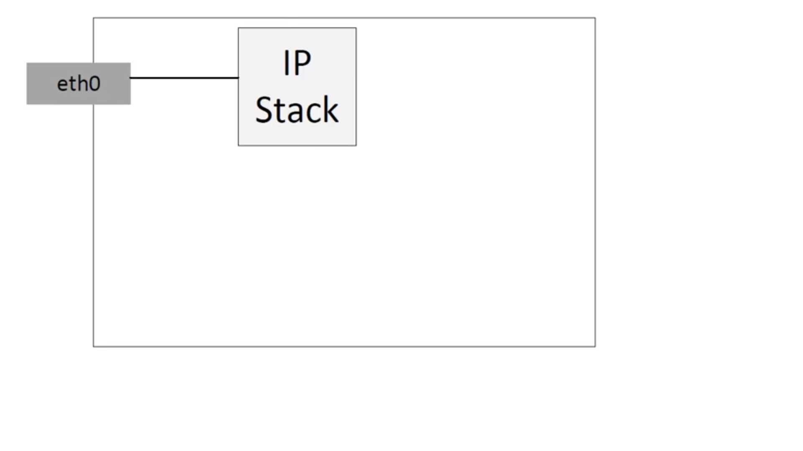

Hypervisors necesitan la posibilidad de puentear tráfico entre VMs y el mundo exterior. En Hypervisors basados en Linux esto significaba usar el switch ya incorporado (Linux bridge) el cual es rápido y confiable. Entonces por qué usar Open vSwitch.

OVS apunta a los desplieges de servidores multi-virtualización, un panorama para el cual Linux bridge no es lo más adecuado. Estos entornos estan caracterizados por extremos altamente dinámicos, mantenimiento de abstracciones lógicas, y a veces la integración o descarga a hardware especializado en switching.

Open vSwitch es un switch OpenFlow que tipicamente es usado con hypervisors con el fin de interconectar maquinas virtuales dentro de un host y maquinas virtuales dentro de distintos hosts a lo largo de varias redes. También es usado en algunos tipos de hardware dedicado al switching. Puede ser una parate crítica en una solución SDN.

OVS soporta las siguentes características:
* VLAN taggin y 802.1q trunking.
* Standar spanning tree protocol (802.1D).
* LACP.
* Port mirroring (SPAN/RSPAN).
* Flow export.
* Tunneling (GRE, VXLAN, IPSEC).
* Control QoS.

### Demostración.
#### Estado inicial
eth0 obtiene su ip y default gateway por DHCP.


Creamos un switch virtual.
``` bash
root@ubuntu:~ ovs-vsctl add-br mybridge
root@ubuntu:~ ovs-vsctl show
85d2f426-5bd8-4b58-a985-f3dc51347b42
    Bridge mybridge
        Port mybridge
            Interface mybridge
                type: internal
    ovs_version: "2.5.2"
```
Aqui vemos la el switch creado, con un solo puerto interno con el nombre mybridge

Luego levantamos el puerto con ifconfig
``` bash
root@ubuntu:~ ifconfig mybridge up
root@ubuntu:~ ifconfig
mybridge  Link encap:Ethernet  HWaddr aa:f8:c3:5c:2e:4c
          inet6 addr: fe80::a8f8:c3ff:fe5c:2e4c/64 Scope:Link
          UP BROADCAST RUNNING MULTICAST  MTU:1500  Metric:1
          RX packets:0 errors:0 dropped:0 overruns:0 frame:0
          TX packets:3 errors:0 dropped:0 overruns:0 carrier:0
          collisions:0 txqueuelen:1
          RX bytes:0 (0.0 B)  TX bytes:258 (258.0 B)
```
Podemos ver la interface ``mybridge``. Si deseamos eliminar la interface: ```ovs-vsctl del-br mybridge```
